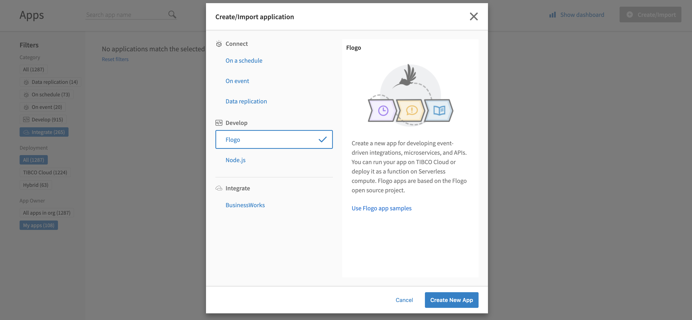

# json.path Sample

## Description

This is json.path sample. It demonstrates, how to get value from JSON object using json.path expression.
json.path mapper function is used to extract a specific element from an Object
JSONPath is an XPath like query language for JSON. 
Reference: https://github.com/oliveagle/jsonpath

For example - if we have Books JSON Object, and we want to get value of category of the 1st book, then we will use json.path function as below -

json.path("$.book[0].category", $flow.body.store)

	* 1st argument - JSONPath syntax of the element
	* 2nd argument - JSON Object in which to find the element

## Operators
referenced from github.com/jayway/JsonPath

Operator | Supported | Description
-------- | --------- | -----------
$ |	Y | The root element to query. This starts all path expressions.
@ | Y | The current node being processed by a filter predicate.
.. | X | Deep scan. Available anywhere a name is required.
. | Y | Dot-notated child
['' (, '')] | X | Bracket-notated child or children
[ (, )] | Y | Array index or indexes
[start:end] | Y |Array slice operator
[?()] | Y | Filter expression. Expression must evaluate to a boolean value.
*  * | X | Wildcard. Available anywhere a name or numeric are required.

## Examples

1. json.path("$.book[0].category", $flow.body.store)  ---> Will return reference
2. json.path("$.book[?(@.author == 'Nigel Rees')].category[0]", $flow.body.store) ---> Will return reference
3. json.path("$.book[?(@.Availability[?(@.Quantity >= 6000)])].category[0]", $flow.body.store) --> Will return fiction3
4. json.path("$.book[?(@.Availability[?(@.Address[?(@.city == 'sugarland')])])].category[0]", $flow.body.store) ---> Will return fiction2

## Understanding the configuration

In the attached sample *jsonpath.sample.json*, there is a flow *jsonpath example* which takes book store object *bookstore_input.json* as input and returns book category attribute value using json.path function.

It also returns book category when book author is 'Nigel Rees', when Availability Quantity is >=6000, when Availability Address city is 'sugarland'

You can also import FLOGO Tester Launch Configuration - *jsonpath_example_Launch_Configuration_1.json*, attached in this sample and start testing in Flow Tester.

## Import a sample

1. Download the sample's .json file.

2. Create a new empty app.

3. On the app details page, select Import app.

4. Browse on your machine or drag and drop the .json file for the app that you want to import.

5. Click Upload. The Import app dialog displays some generic errors and warnings as well as any specific errors or warnings pertaining to the app you are importing. It validates whether all the activities and triggers used in the app are available in the Extensions tab.

6. You have the option to import all flows from the source app or selectively import flows.

7. Click Next. If you had not selected a trigger in the previous dialog, the flows associated with that trigger are displayed. You have the option to select one or more of these flows such that the flows get imported as blank flows that are not attached to any trigger. By default, all flows are selected. Clear the check box for the flows that you do not want to import. If your flow(s) have subflows, and you select only the main flow but do not select the subflow, the main flow gets imported without the subflow. Click Next.

## Contributing
If you want to build your own activities for Flogo please read the docs here.

If you want to showcase your project, check out [tci-awesome](https://github.com/TIBCOSoftware/tci-awesome)

You can also send an email to `tci@tibco.com`

## Feedback
If you have feedback, don't hesitate to talk to us!

* Submit feature requests on our [TCI Ideas](https://ideas.tibco.com/?project=TCI) or [FE Ideas](https://ideas.tibco.com/?project=FE) portal
* Ask questions on the [TIBCO Community](https://community.tibco.com/answers/product/344006)
* Send us a note at `tci@tibco.com`

## Help
Please visit our [TIBCO Cloud&trade; Integration documentation](https://integration.cloud.tibco.com/docs/) and TIBCO Flogo® Enterprise documentation on [docs.tibco.com](https://docs.tibco.com/) for additional information.

## License
This TCI Flogo SDK and Samples project is licensed under a BSD-type license. See [license.txt](license.txt).
