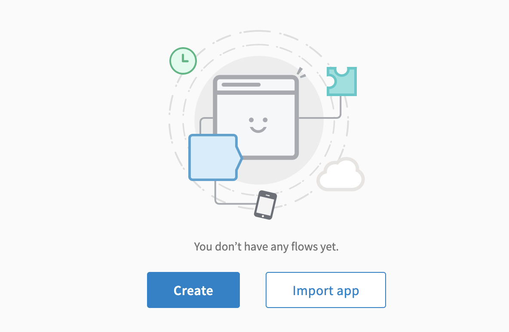

# Loops Sample

## Description

This is Loops Sample. It demonstrates the use of Loops in FLOGO - Iterator, Repeat while true alogng with Accumulate output as true.

Loop can be used to execute an activity (including Start Subflow) multiple times.

* Iterate -  allows you to iterate for a specified count or over an array or object.

* Repeat while true - repeat the execution if the condition is true

## Understanding the configuration

In the attached *loops.sample.json* app, there are 2 flows - *Loop-Iterate* and *Loop-repeat while true* and there is one subflow which is called from *Loop-Iterate* flow.

*Loop-Iterate* takes input of books array *books_input.json* and iterates over a subflow based on how many books are there in the input array. The subflow output is then Accumulated returned back as the REST Service Response.

You can also import FLOGO Tester Launch Configuration - *Loop-Iterate_Launch_Configuration_1.json*, attached in this sample and start testing in Flow Tester for this flow.

*Loop-repeat while true* flow called external REST service using InvokeRESTService activity and then based on Iterator and Repeat while true conditions, these activites are then executed.

Please see expected output *iterator_output.png* and *repeat-while-true_output.png* for these flows.

## Import a sample

1. Download the sample's .json file.

2. Create a new empty app.

3. On the app details page, select Import app.

4. Browse on your machine or drag and drop the .json file for the app that you want to import.

5. Click Upload. The Import app dialog displays some generic errors and warnings as well as any specific errors or warnings pertaining to the app you are importing. It validates whether all the activities and triggers used in the app are available in the Extensions tab.

6. You have the option to import all flows from the source app or selectively import flows.

7. Click Next. If you had not selected a trigger in the previous dialog, the flows associated with that trigger are displayed. You have the option to select one or more of these flows such that the flows get imported as blank flows that are not attached to any trigger. By default, all flows are selected. Clear the check box for the flows that you do not want to import. If your flow(s) have subflows, and you select only the main flow but do not select the subflow, the main flow gets imported without the subflow. Click Next.

## Contributing
If you want to build your own activities for Flogo please read the docs here.

If you want to showcase your project, check out [tci-awesome](https://github.com/TIBCOSoftware/tci-awesome)

You can also send an email to `tci@tibco.com`

## Feedback
If you have feedback, don't hesitate to talk to us!

* Submit feature requests on our [TCI Ideas](https://ideas.tibco.com/?project=TCI) or [FE Ideas](https://ideas.tibco.com/?project=FE) portal
* Ask questions on the [TIBCO Community](https://community.tibco.com/answers/product/344006)
* Send us a note at `tci@tibco.com`

## Help

Please visit our [TIBCO Cloud&trade; Integration documentation](https://integration.cloud.tibco.com/docs/) and TIBCO Flogo® Enterprise documentation on [docs.tibco.com](https://docs.tibco.com/) for additional information.

## License
This TCI Flogo SDK and Samples project is licensed under a BSD-type license. See [license.txt](license.txt).
