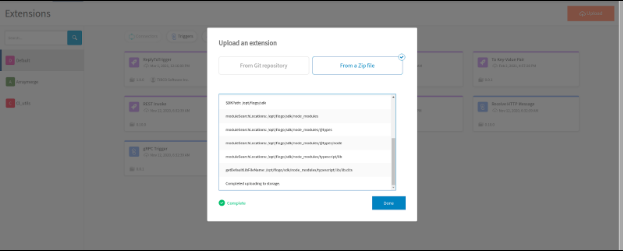
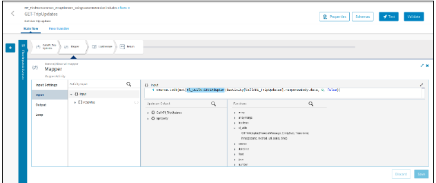

# Protobuf to JSON Extension

# Prerequisites
TIBCO Cloud™ Integration - latest version.

## Overview
This is a custom extension (function) to convert General Transit Feed Specification (GTFS) protobuf message format to JSON format. The extension is optimized for enterprise usage and from a scalability perspective. 

## Usage details
### Syntax: GTSFSAdapter(ProtobufMessage(string), EntitySize(int), Transform(bool))
### Parameters:
  1. ProtobufMessage: is the protobuf message to be converted to JSON format.
  2. EntitySize: is the total number of entities that will be returned in the JSON string. n = actual number of entities in the message.
     * when EntitySize <= 0, return all entities in the message (i.e. n)
     * when EntitySize > 0 and < n, return the number of entity specified in this parameter.
     * when EntitySize >= n, return all entities in the message (i.e. n)
  3. Transform: _boolean_
      * When true, the JSON output will contain the transformed entities.
      * When false, the JSON output will contain the original structure of the entities.

## Example
### Syntax with input parameters: 
              GTSFSAdapter(Protobuf_message, 25, false)
Now, the function will process the first 25 entities of the message without any transformation and will return the JSON string in the output.

## Steps to use the Protobuf to JSON extension:
1. Download the extension on your file system from [here](https://github.com/TIBCOSoftware/tci-flogo/blob/master/samples/extensions/Protobuf_To_JSON/cl_utils_2.0.zip)
2. Login to TIBCO Cloud™ Integration with a valid subscription. 
3. Select Environment & Tools menu option.
4. Under Connector Management & Extensions section, choose Extensions option. 
5. Under Extensions, select the Upload button. 
6. Select “From a Zip File” tab and navigate to the zip file on your file system as shown in the snapshot below. (from step #1) This step will upload the extension and make it available to use in the Flogo flows. 
7. You can now access the function (as shown below) under the Functions section by the name, cl_utils.

## Sample Apps for reference:

Please refer to any of the available sample apps [here](https://github.com/TIBCOSoftware/tci-flogo/tree/master/samples/app-dev/Array-Operations)
* FindCommonArrayElement-UsingCustomExtension
* FindCommonArrayElements
* Find_NonCommonArrayElement-UsingCustomExtension
* Find_NonCommonArrayElements
